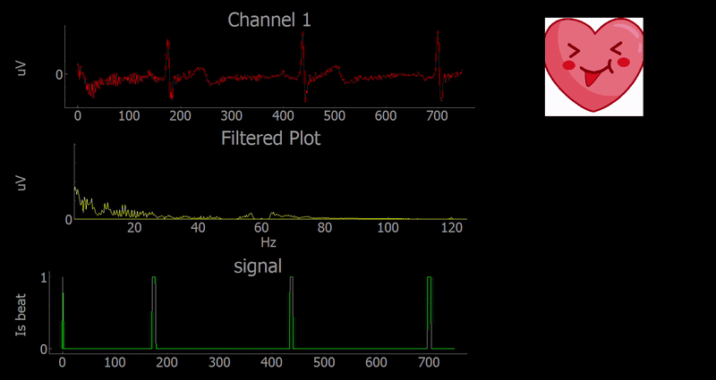

# Use heartbeats as triggers to make an image of a heart move using the OpenBCI Cyton board

## What this is?
This project is to learn how to use the Cyton board to obtain heartbeat data, process it, and use is as a trigger. A similar approach can be used for EMG data to use as triggers to control something else.

## Next steps...
Make a similar tutorial for EMG data from the arm and see if we can recognize specific finger movement from one arm.

